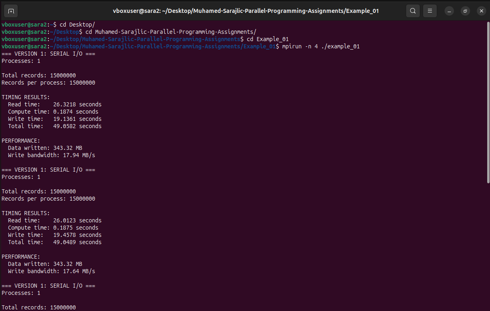
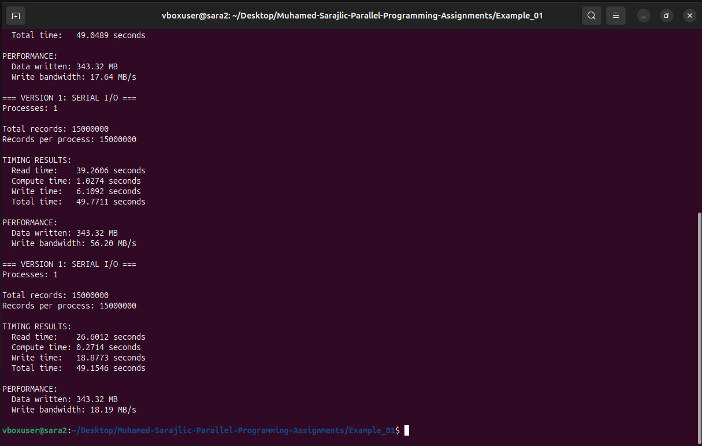
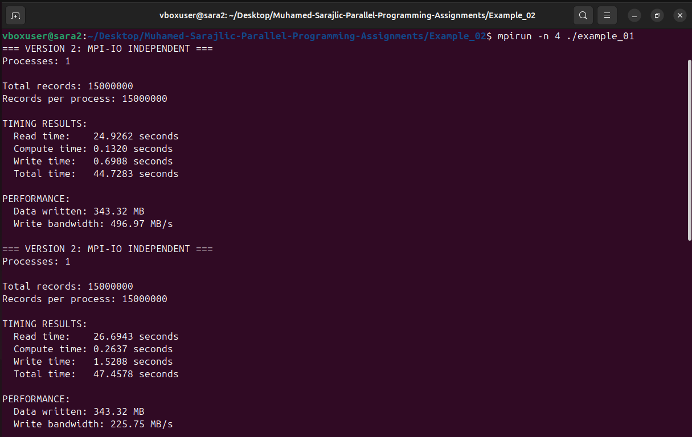
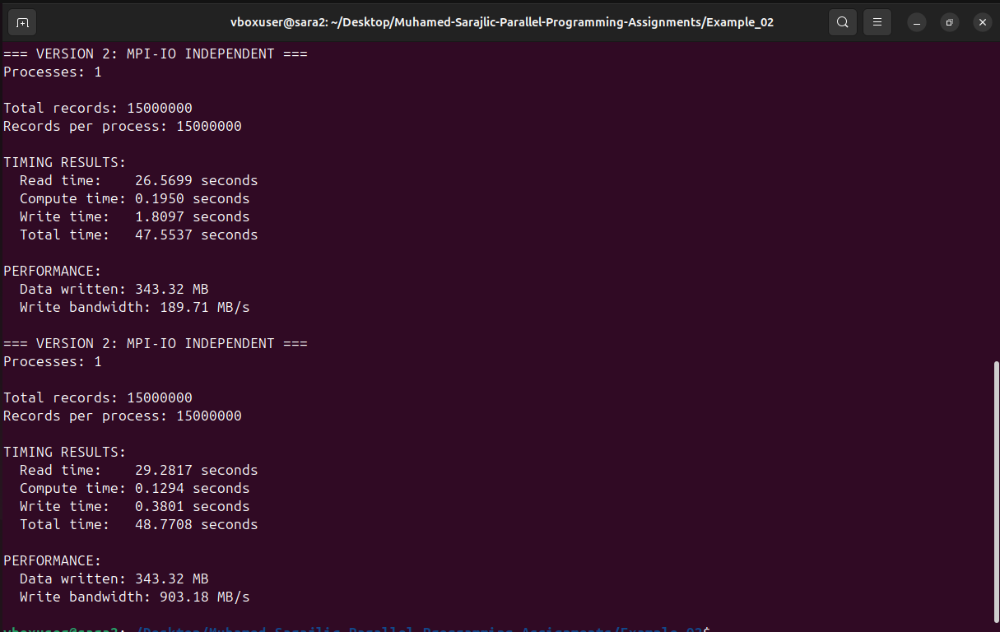
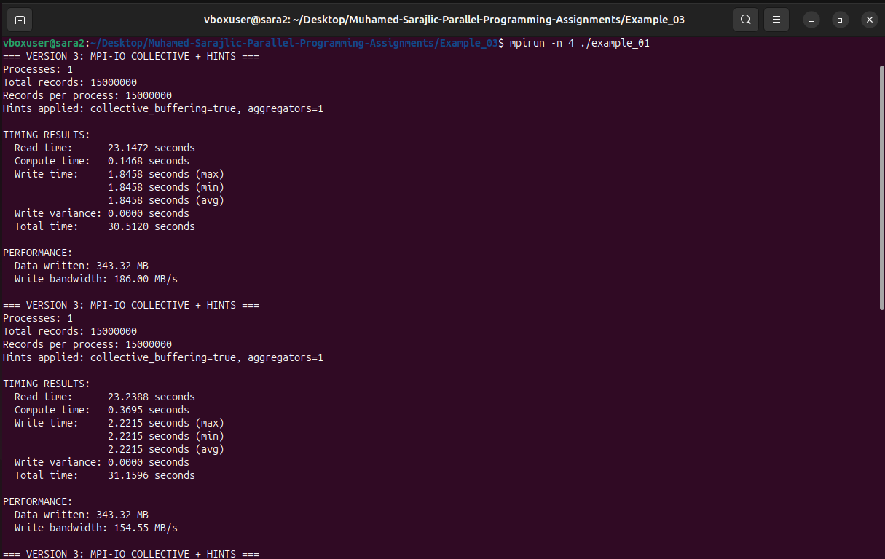
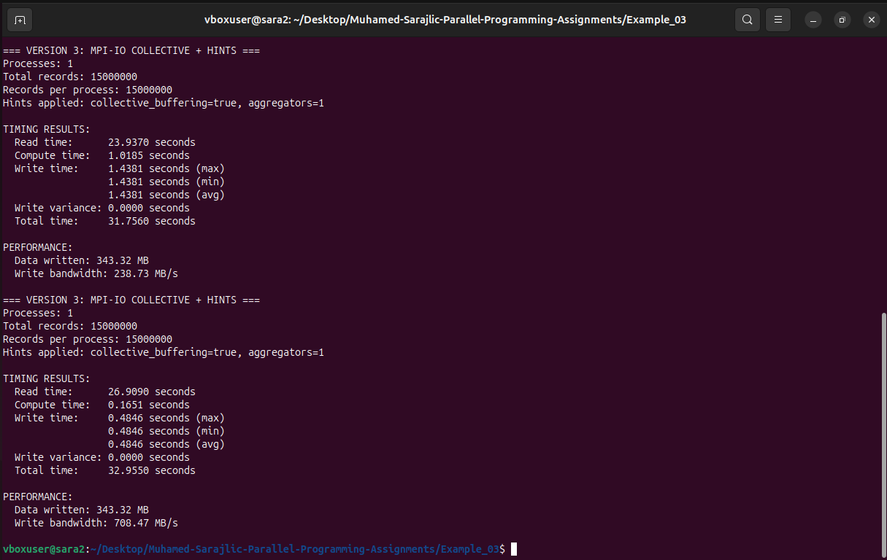
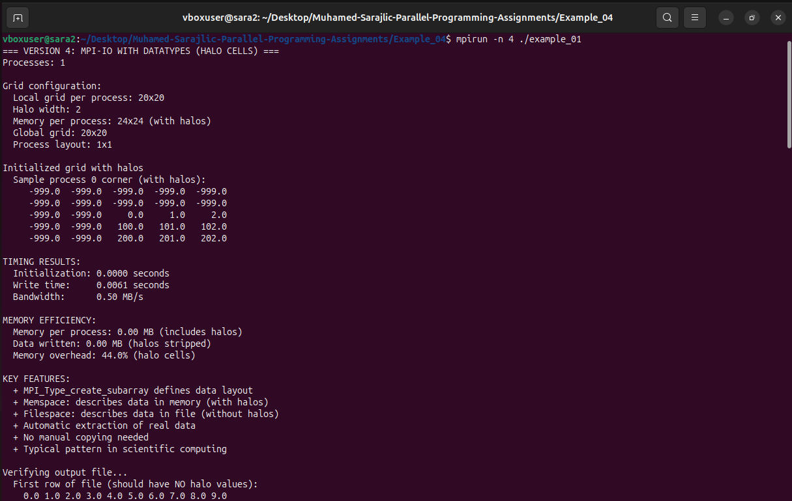
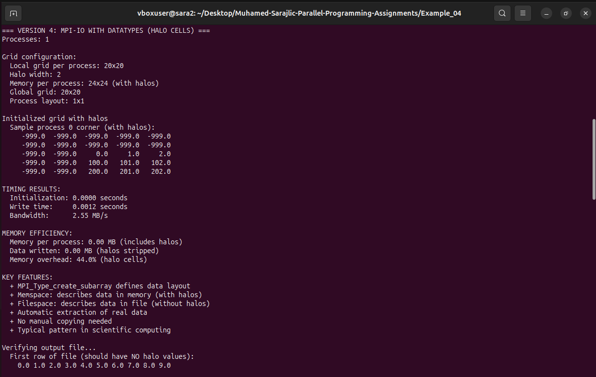
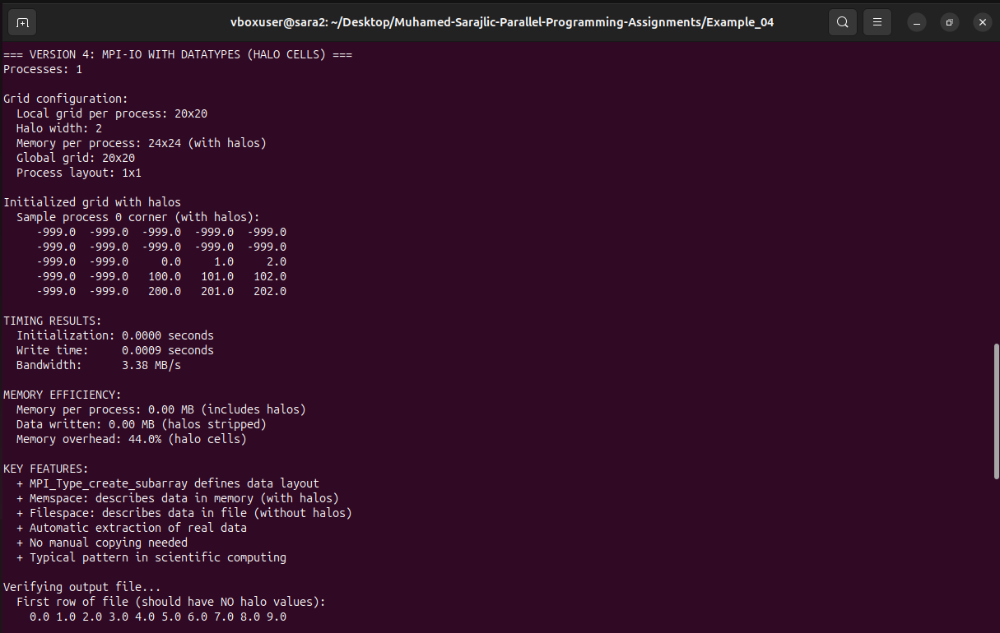
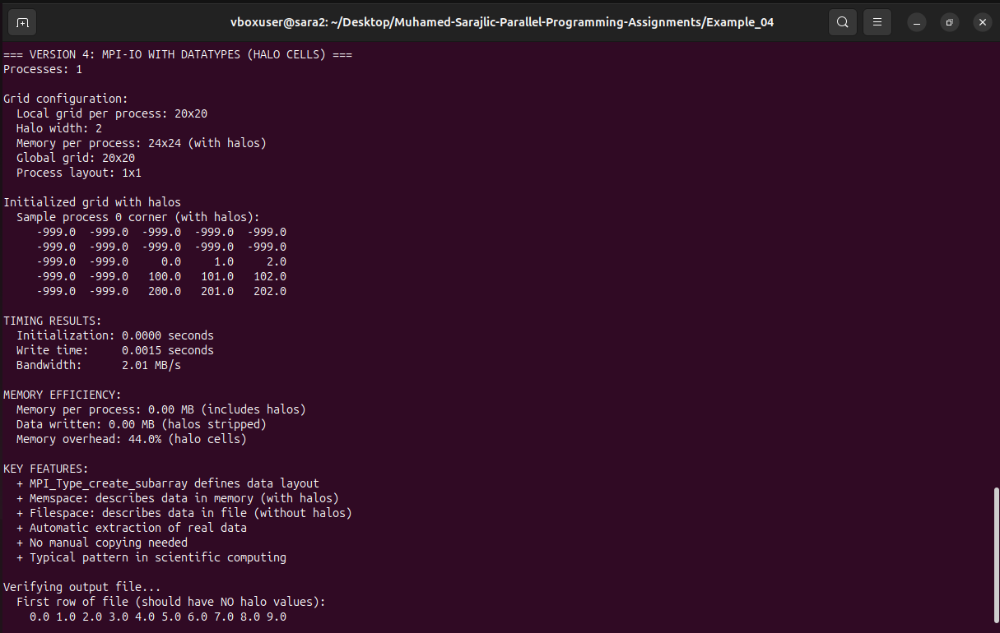

# Muhamed-Sarajlic-Parallel-Programming-Assignments

***Example 1***

***Example 2***

***Example 3***

***Example 4***

1. Elaborate on what are the main differences between executions.

- Example_01 uses serial file I/O where only rank 0 reads entire input file, allocates memory and performs while writing.

- Example_02 uses independant MPI-IO, all processes open the file and read their part of data and write independently in their file offsets, there is no centralized memory usage.

- Example_03 uses collective MPI-IO with hints, where processes work together, coordinating and optimizing disk access.

2. Explain what is the difference between execution times.

- Example_01 is the worst/slowest and unstable due to serial I/O and memory bottlenecks.

- Example_02 is much faster because of file I/O and memory usage are distributed.

- Example_03 has more stable and usually lower exec time due to collective buffering and coordinated writes.

3. Explain why is there drastic difference between Example_01 and Example_02/Example_03.

- Example_01 forces all file I/O and memory alloc on rank 0, which causes memory exhaustion and network obstruction which can lead to termination on large datasets. Example_01 and Example_02 dont have this problem because they eliminate bottleneck with distribution of all O/I and memory across all processes.

4. Since we haven’t defined all checkpoints for Example_03, you need to do a little bit of an
investigation and provide what Example_03 brings to the table in terms of improvements.

- Example_03 introduces collective MPI-IO with MPI_File_set_view (defines logical file region for each procces) and MPI_File_write_all (enabling collective and synced writes). Collective buffering allows processes to batch small writes into fewer larger writes.

5. You need to compare Example_03 and Example_02 results and if Example_02 is better
than Example_03, explain why that happens and when Example_03 will fit better than
Example_02.

- Example_02 can be better on some small systems or single node execs due to lower sync overhead.

- Example_03 is better on larger tasks and parallel filesystems, where collective buffering improve scalability and predictability.