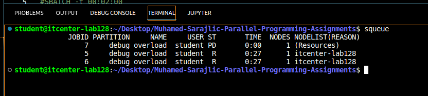
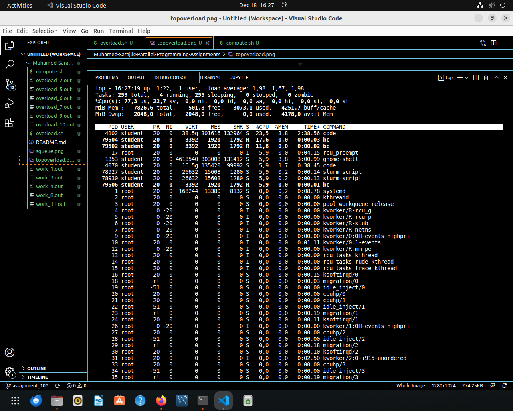
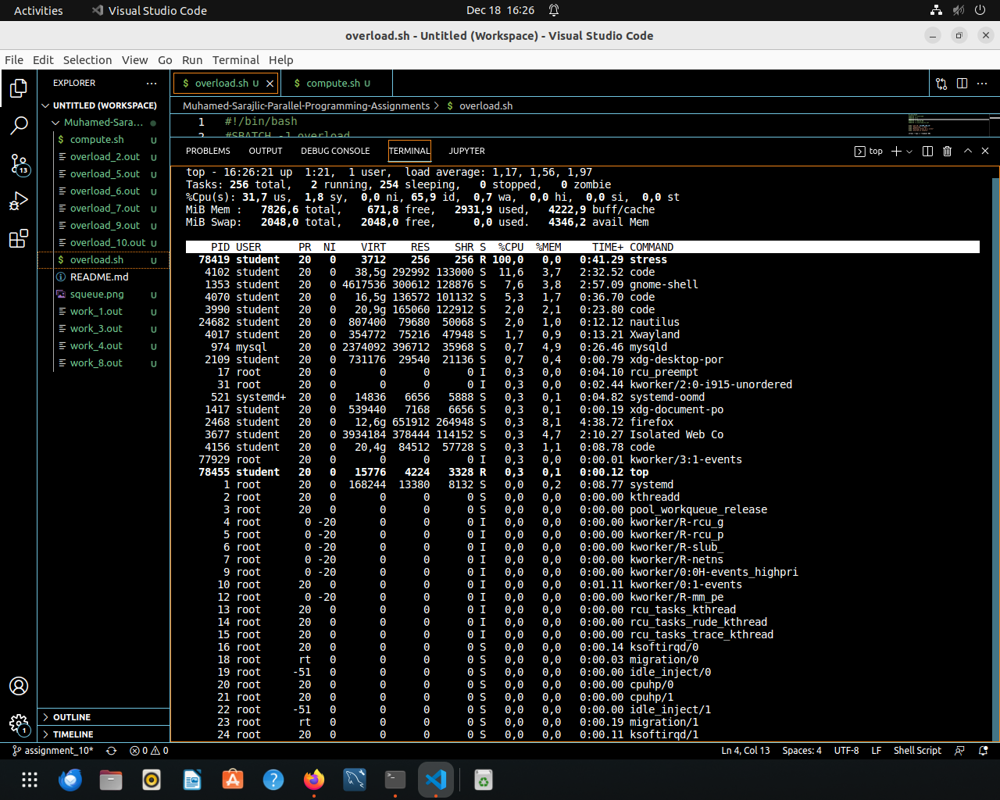
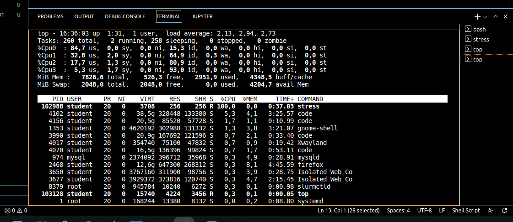

# Muhamed-Sarajlic-Parallel-Programming-Assignments

script executed using sbatch 4 times, each job requested 4cpus

Without Slurm: 
stress executed in 3 terminals, 
resuling in system slowdown and cpu oversubscription. 

With Slurm: 
stress exectued via batch, slurm handled resource alloc correctly