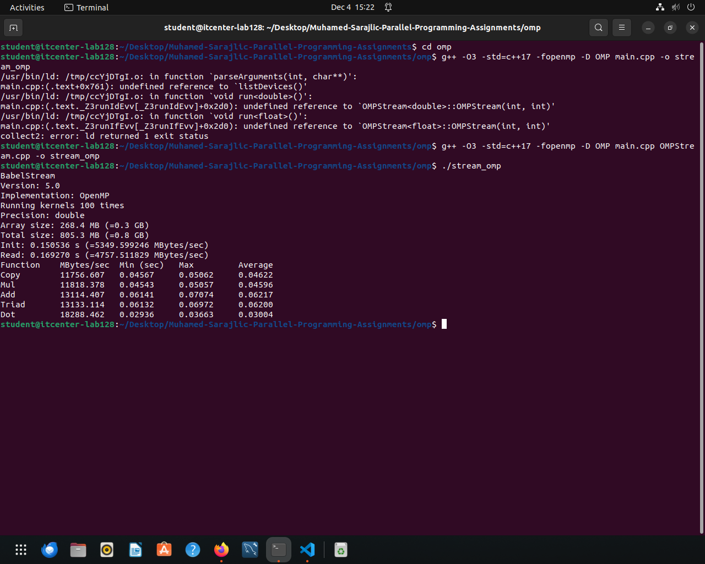
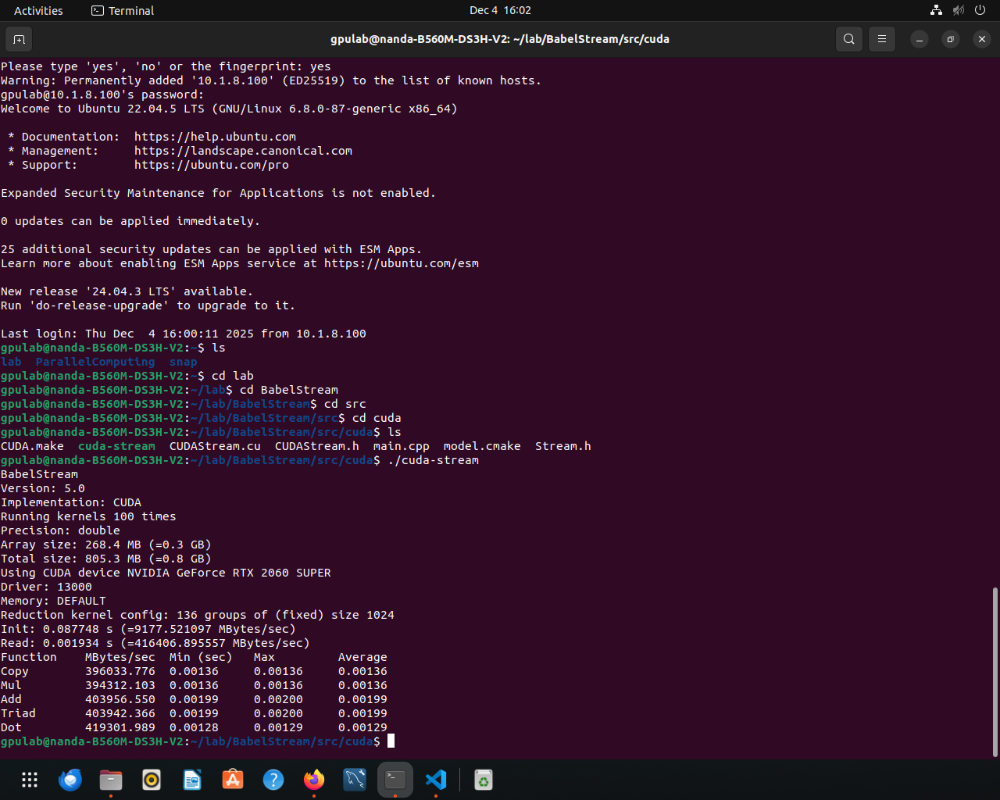

# Muhamed-Sarajlic-Parallel-Programming-Assignments

Implementation: OpenMP
Precision: Double
Array size: 268.4 MB
Total Size: 805.3 MB
Kernel Run: 100
Performance (MB/s):
    - Copy: 11756 MB/s
    - Mul: 11818 MB/s
    - Add: 13114 MB/s
    - Triad: 13133 MB/s
    - Dot: 18288 MB/s

outdated, so no valid iGPU performance results were obtained

Device: NVIDIA GeForce RTX 2060 SUPER
Driver: 13000
Precision: Double
Array Size: 268.4 MB
Kernels run: 100
CUDA Configuration:
    - Threads per block: 1024
    - Number of blocks: 136
    - Total GPU threads used (1024 * 136) = 139264 threads
Performance (MB/s):
    - Copy: 396033 MB/s
    - Mul: 394312 MB/s
    - Add: 403956 MB/s
    - Triad: 403942 MB/s
    - Dot: 419301 MB/s
extremly massive parallelism and very high memory bandwith utilization due to thousands of GPU threads running at the same time

Discrete GPU (RTX 2060S) is more than 30x faster than CPU due to 139264 concurrent GPU threads, much higher memory bandwith and dedicated VRAM