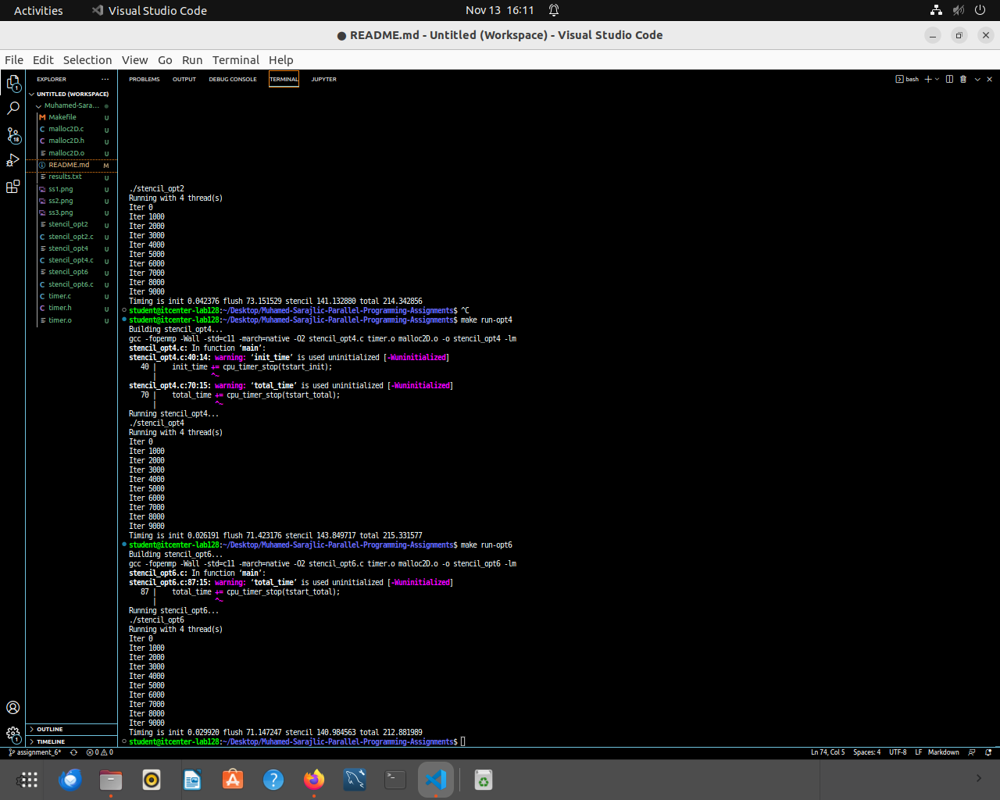
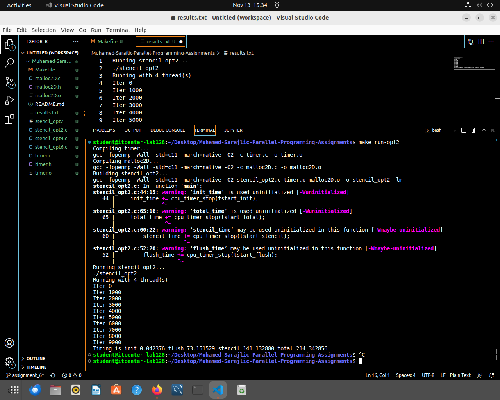
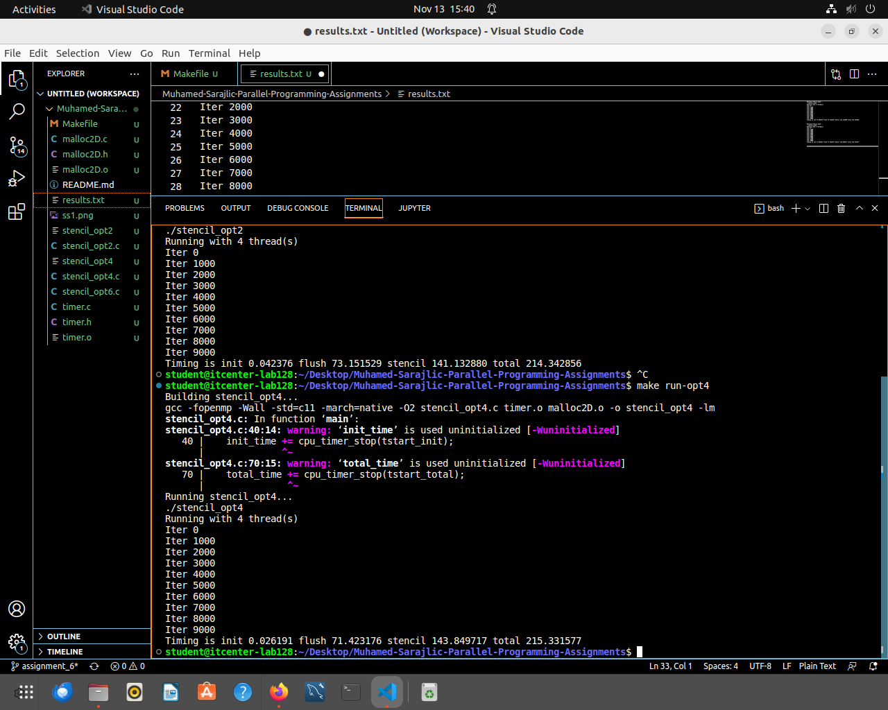
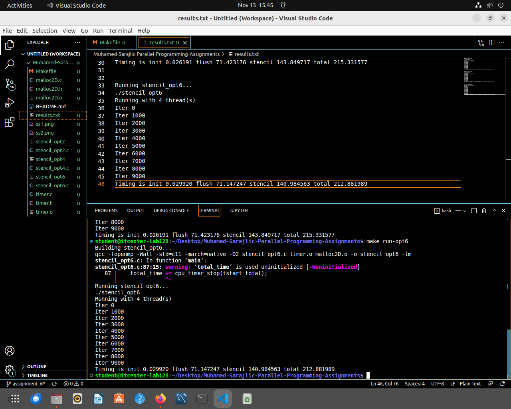

# Muhamed-Sarajlic-Parallel-Programming-Assignments

Running stencil_opt2...
./stencil_opt2
Running with 4 thread(s)
Iter 0
Iter 1000
Iter 2000
Iter 3000
Iter 4000
Iter 5000
Iter 6000
Iter 7000
Iter 8000
Iter 9000
Timing is init 0.042376 flush 73.151529 stencil 141.132880 total 214.342856

Running stencil_opt4...
./stencil_opt4
Running with 4 thread(s)
Iter 0
Iter 1000
Iter 2000
Iter 3000
Iter 4000
Iter 5000
Iter 6000
Iter 7000
Iter 8000
Iter 9000
Timing is init 0.026191 flush 71.423176 stencil 143.849717 total 215.331577

Running stencil_opt6...
./stencil_opt6
Running with 4 thread(s)
Iter 0
Iter 1000
Iter 2000
Iter 3000
Iter 4000
Iter 5000
Iter 6000
Iter 7000
Iter 8000
Iter 9000
Timing is init 0.029920 flush 71.147247 stencil 140.984563 total 212.881989

these represent progressive optimization levels of the same stencil computation

***1) stencil_opt2***
- good but not optimal, high time flush indicates a lot of memory movement (cache misses)

***2) stencil_opt4***
- slightly faster flush, slightly slower stencil kerne, total time is almost identical as in opt2
- this optimization helps one part but hurts another

***3) stencil_opt6***
- best total time(212.88s), lowest stencil compute time, flush is a bit faster than in opt2 and opt4
- opt6 has best balance of cache usage, reduced thread waiting and it has most efficiend memory access patters

1. How many threads your CPU used to execute the code?
--> Cpu used 4 threads for all three implementations

2. What are the parts of the code that were improved? What strategies were used to improve the code?
--> main improvement is between opt2 and opt4 where the code user long parallel region instead of creating new threads in loops, that reduced fork-join overhead and make it smoother overall. Improvement from opt4 to opt6 is that we divided the work manually among the threads, reducing sync time and improving memeory access

3. What is the difference between explicit and implicit barriers inside the code and did they exist inside any of these examples? What do they actually mean? 
--> implicit barriers are automatically inserted by OpenMP at the end of constructs, explicit barriers are manually added to force sync at specific point in the code. 

