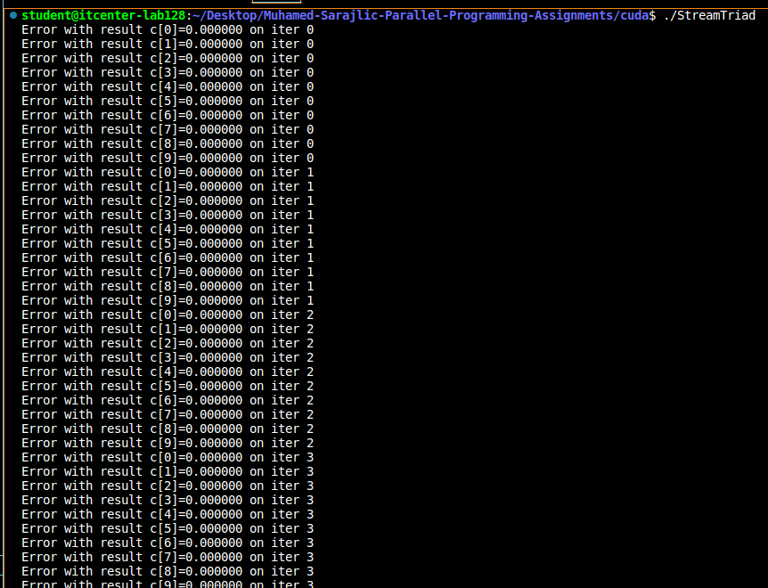
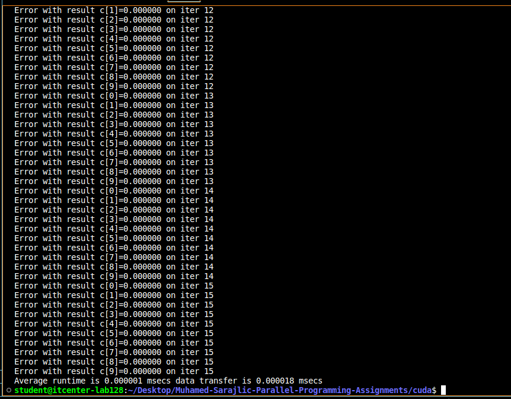
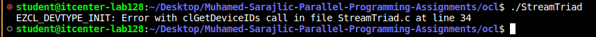
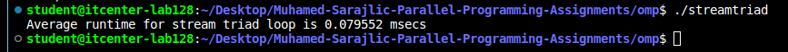
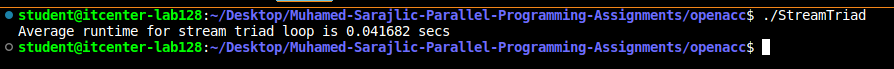
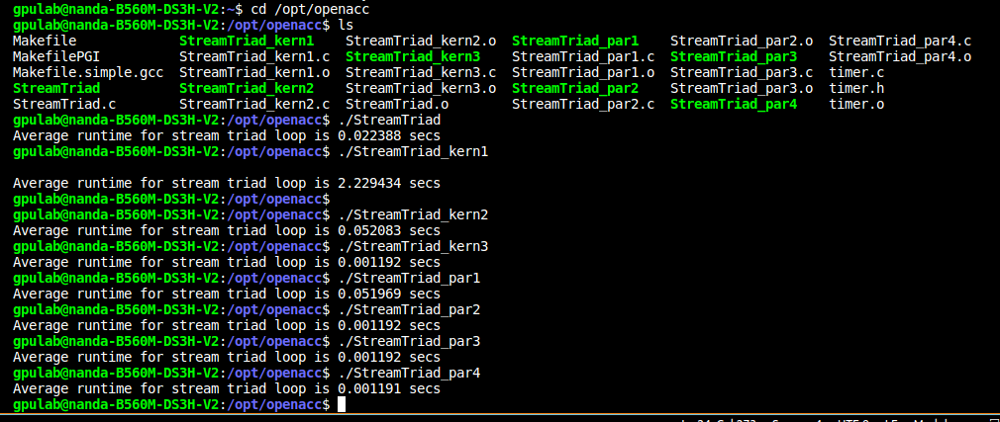

# Muhamed-Sarajlic-Parallel-Programming-Assignments

***CUDA***

Cuda version failed because all GPU computations produced 0.000000, which means that GPU didnt work wiht correctly initialized data. This very small runtime shows that expected computation never happened, it continued running without reporting errors, resulting in incorrect output for every iteration

***OCL***

OpenCL verison failed during device detection because the call to clGetDeviceIDs returned an error. Error indicates that no suitable OCL device was found or the device did not meet the required capabilities, causing EZCL initialization routine to terminate early

***OMP***

Completed successfully because OMP runs on the CPU and does not require device discovery, kernel compilation, or GPU memory management. OMP uses simple compiler pragmas to parallellize loops without involving separate device. Program reported an average runtime of ~0.079ms

***OPENACC***

OpenACC ran successfully bacause it uses high level compiler directives that hide device discovery and memory manamegemt details. Even if no GPU is available, OpenACC falls back to a valid execution path on the cPU or another available backend. Average runtime of ~0.0416s

When running OpenACC versions on server, each executable gave different runtime. This happened bcz OpenACC uses compiler directives, and generate different GPU kernels depending on how pragmas are written. The fastest version is par4. OpenACC hides device management, but performance varies based on how much optimization each directive enables